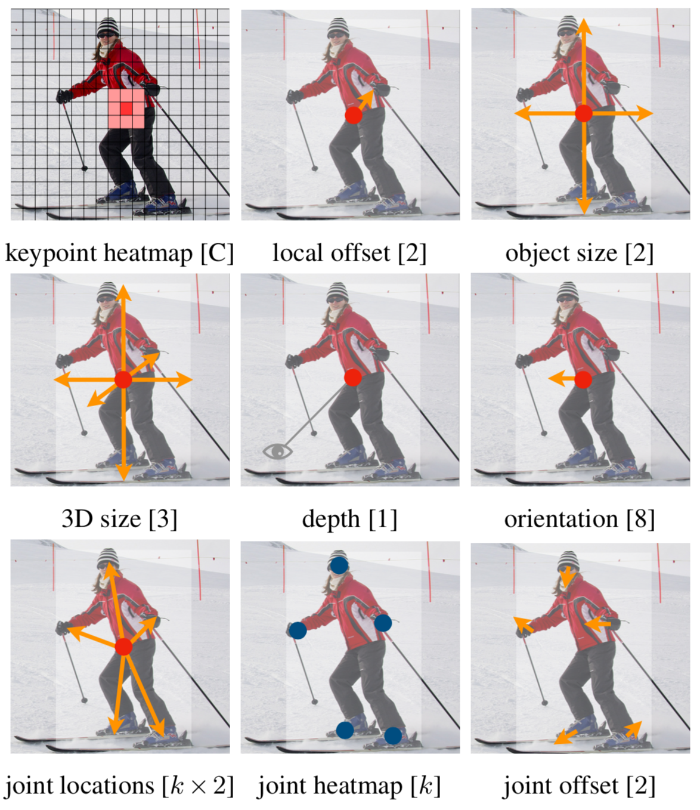
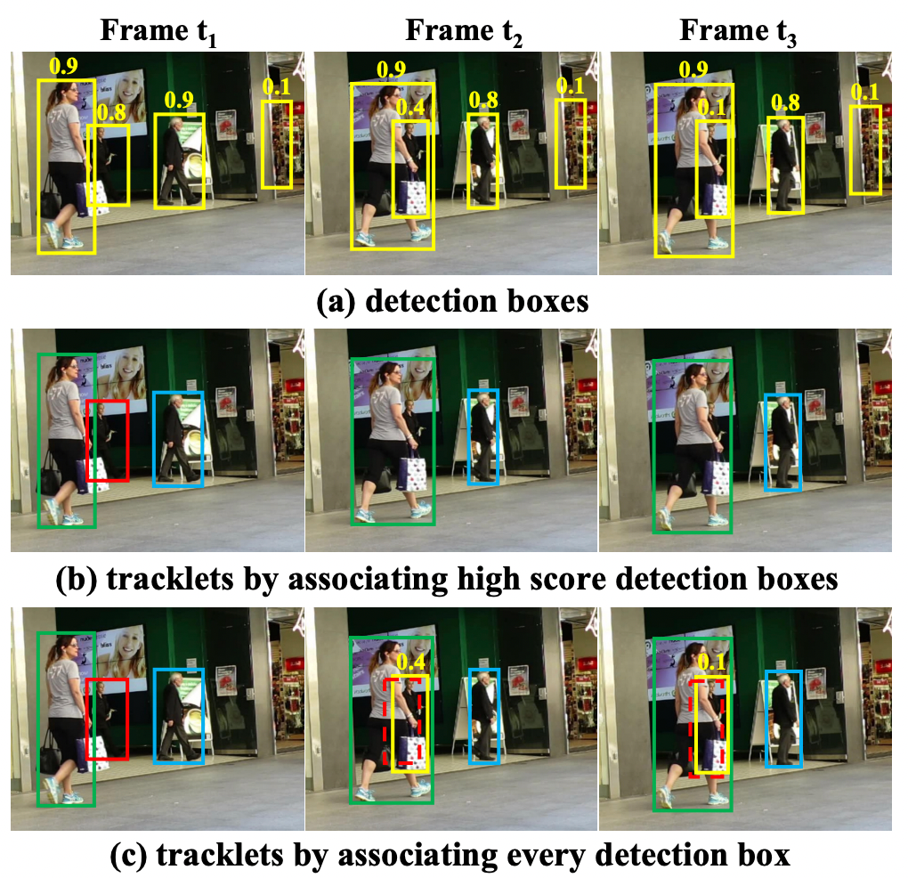

# CenterNet + ByteTrack

## [Detector] CenterNet

  

 - Reference Paper: [**Objects as Points**](https://arxiv.org/pdf/1904.07850.pdf)

 - Reference Code: [**CenterNet**](https://github.com/xingyizhou/CenterNet)

## [Tracker] ByteTrack

  

 - Reference Paper: [**ByteTrack: Multi-Object Tracking by Associating Every Detection Box**](https://arxiv.org/pdf/2110.06864.pdf)

 - Reference Code: [**ByteTrack**](https://github.com/ifzhang/ByteTrack)

## Demo
We support demo for image/ image folder, video, and webcam. 

First, download the models (By default, [ctdet_coco_dla_2x](https://drive.google.com/file/d/18Q3fzzAsha_3Qid6mn4jcIFPeOGUaj1d) for detection and 
[multi_pose_dla_3x](https://drive.google.com/file/d/1mC2PAQT_RuHi_9ZMZgkt4rg7BSY2_Lkd) for human pose estimation) 
from the [Model zoo](readme/MODEL_ZOO.md) and put them in `CenterNet_ROOT/models/`.

For object detection on images/ video, run:

~~~
python demo.py ctdet --demo /path/to/image/or/folder/or/video --load_model ../models/ctdet_coco_dla_2x.pth
~~~
We provide example images in `CenterNet_ROOT/images/` (from [Detectron](https://github.com/facebookresearch/Detectron/tree/master/demo)). If set up correctly, the output should look like

   

For webcam demo, run     

~~~
python demo.py ctdet --demo webcam --load_model ../models/ctdet_coco_dla_2x.pth
~~~